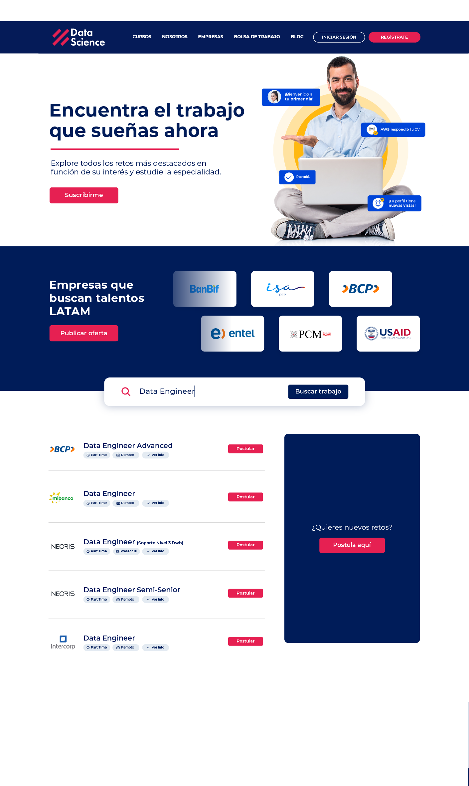

# Prueba técnica: Frontend Developer Junior

## Bienvenida/o 👋

La prueba técnica determinará el nivel de tus conocimientos.

Estás lista/o?

**Para realizar este reto, necesita un conocimiento de HTML y CSS/SASS. Un plus es hacerlo con Angular 10+**

## Compartenos tu resultado

1. Asegurate de tener tu reto terminado, súbelo a GitHub.
2. Notificar por Linkedin la culminación del proyecto.

**Diviértete y disfruta resolviendo esta prueba técnica !** 🚀
